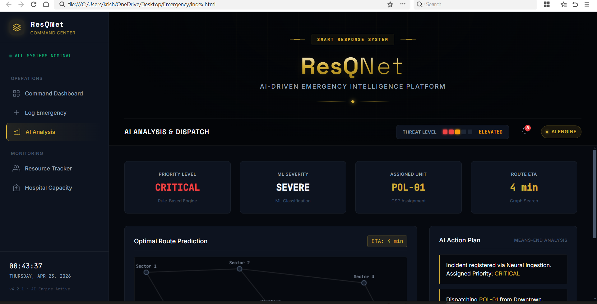

Problem Description:

ResQNet is an AI-powered Smart Emergency Response & Decision Support System developed to enhance emergency management during critical situations such as accidents, fires, and medical emergencies. The system is designed to assist emergency response teams by analyzing emergency data, predicting severity levels, assigning rescue resources, and generating optimized response plans in real time.

The platform integrates Artificial Intelligence techniques to improve decision-making efficiency, reduce response time, and support better coordination between hospitals, ambulances, and rescue teams. The dashboard provides a professional command-center interface for monitoring emergency operations and managing resources effectively.

Algorithms Used:

1. Graph Search Algorithm (BFS / A* Search)
   Used for identifying the shortest and most efficient route between emergency locations and rescue units. This helps reduce response time during emergencies.

2. Constraint Satisfaction Problem (CSP)
   Used for intelligent allocation of resources such as ambulances, hospitals, and rescue teams based on availability, distance, and emergency priority.

3. Rule-Based System
   Used for emergency priority classification. The system analyzes severity level, delay time, and risk conditions to categorize emergencies into High, Medium, or Low priority levels.

4. Means-End Analysis
   Used for generating a structured step-by-step emergency response procedure, including emergency detection, resource assignment, route optimization, and rescue coordination.

5. Machine Learning-Based Severity Prediction
   Used for predicting emergency severity levels based on user inputs such as emergency type, risk level, and response delay, supporting AI-based decision-making.

Execution Steps

1. Download or clone the repository from GitHub.

2. Open the project folder containing the source files.

3. Run the project by opening the `index.html` file in a web browser.

4. Enter the required emergency details such as:

   * Location
   * Emergency type
   * Severity level
   * Risk level
   * Delay time

5. Click the “Analyze Emergency” button to process the emergency information.

6. The system generates outputs including:

   * Emergency priority level
   * Assigned rescue resources
   * Route optimization results
   * AI-generated emergency response plan
   * Severity prediction and emergency insights
  
Sample Output 

