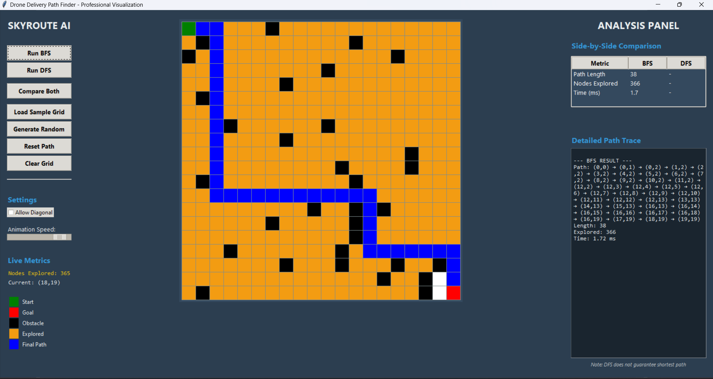
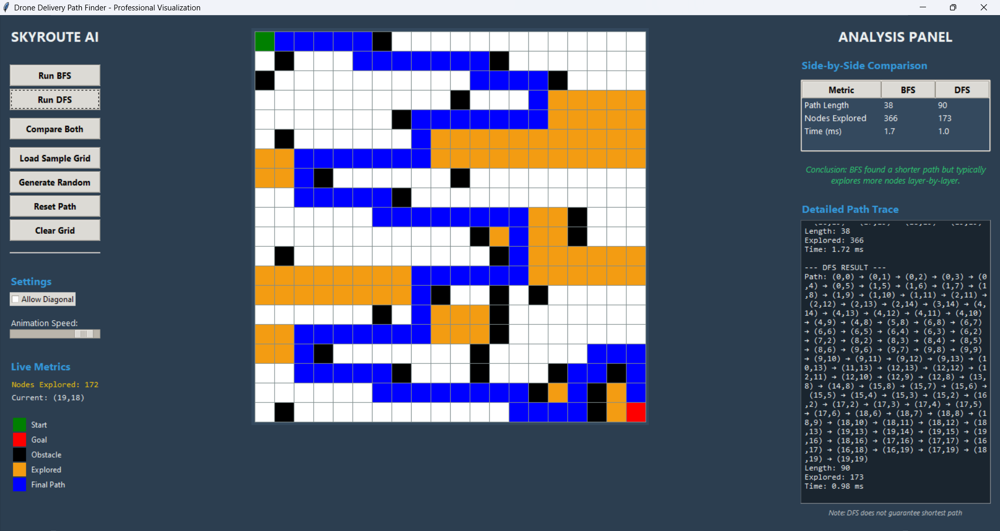

AI Problem Solving Assignment

👥 Team Members
         Krishna Priya P S (Reg No: RA2411026050029)
         A S Lekshmi Priya (Reg No: RA2411026050068)

PROBLEM 20 Smart Emergency Response and Decision Support System

Problem Description:

ResQNet is an AI-powered Smart Emergency Response & Decision Support System developed to enhance emergency management during critical situations such as accidents, fires, and medical emergencies. The system is designed to assist emergency response teams by analyzing emergency data, predicting severity levels, assigning rescue resources, and generating optimized response plans in real time.

The platform integrates Artificial Intelligence techniques to improve decision-making efficiency, reduce response time, and support better coordination between hospitals, ambulances, and rescue teams. The dashboard provides a professional command-center interface for monitoring emergency operations and managing resources effectively.

Algorithms Used:

1. Graph Search Algorithm (BFS / A* Search)
   Used for identifying the shortest and most efficient route between emergency locations and rescue units. This helps reduce response time during emergencies.

2. Constraint Satisfaction Problem (CSP)
   Used for intelligent allocation of resources such as ambulances, hospitals, and rescue teams based on availability, distance, and emergency priority.

3. Rule-Based System
   Used for emergency priority classification. The system analyzes severity level, delay time, and risk conditions to categorize emergencies into High, Medium, or Low priority levels.

4. Means-End Analysis
   Used for generating a structured step-by-step emergency response procedure, including emergency detection, resource assignment, route optimization, and rescue coordination.

5. Machine Learning-Based Severity Prediction
   Used for predicting emergency severity levels based on user inputs such as emergency type, risk level, and response delay, supporting AI-based decision-making.

Execution Steps

1. Download or clone the repository from GitHub.

2. Open the project folder containing the source files.

3. Run the project by opening the `index.html` file in a web browser.

4. Enter the required emergency details such as:

   * Location
   * Emergency type
   * Severity level
   * Risk level
   * Delay time

5. Click the “Analyze Emergency” button to process the emergency information.

6. The system generates outputs including:

   * Emergency priority level
   * Assigned rescue resources
   * Route optimization results
   * AI-generated emergency response plan
   * Severity prediction and emergency insights
  
Sample Output 

PROBLEM 9 Drone Delivery Path Finder System

Problem Description

This project focuses on solving a grid-based pathfinding problem in the context of a drone delivery system. The environment is modeled as a two-dimensional matrix where each cell represents either a traversable space or a restricted zone:

0 → Free path (accessible for drone movement)
1 → Obstacle (no-fly zone)

Given a predefined start position (source) and goal position (destination), the objective is to determine a valid path that allows the drone to reach its destination while avoiding obstacles.
The system not only identifies feasible paths but also evaluates their efficiency using different search strategies. It provides both visual representation and analytical insights into how different algorithms behave in the same environment.

Algorithms 

1. Breadth-First Search (BFS)

Breadth-First Search is a graph traversal algorithm that explores nodes level by level starting from the source node. It uses a queue (FIFO) data structure to systematically visit all neighboring nodes before moving to the next level.
Guarantees the shortest path in an unweighted grid
Explores all possible directions uniformly
Suitable for optimal pathfinding scenarios

2. Depth-First Search (DFS)

Depth-First Search is a traversal algorithm that explores as far as possible along a branch before backtracking. It uses recursion or a stack (LIFO) to dive deep into the search space.
Does not guarantee the shortest path
Can be faster in reaching a solution in certain cases
Useful for exploring all possible paths

Execution Steps

1.Download or clone the repository from GitHub.
2.Open the project folder containing the source files.
3.Run the project by executing the main.py file:
python main.py
4.Create or load a grid environment for the simulation.
5.Enter the required inputs such as:
  Start position
  Goal position
  Obstacles (optional)
6.Click the “Run BFS” or “Run DFS” button to execute the algorithms.
7.The system generates outputs including:
  Path from start to goal
  Path length
  Number of nodes explored
  Execution time
  Visual grid representation
  Comparison between BFS and DFS performance

Sample Output

### BFS Output

### DFS Output

